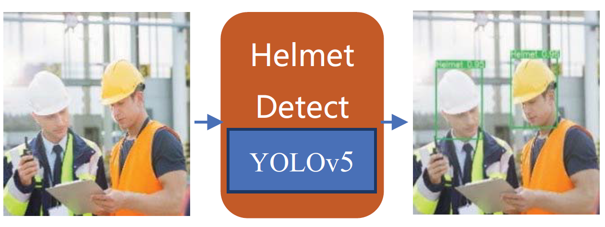
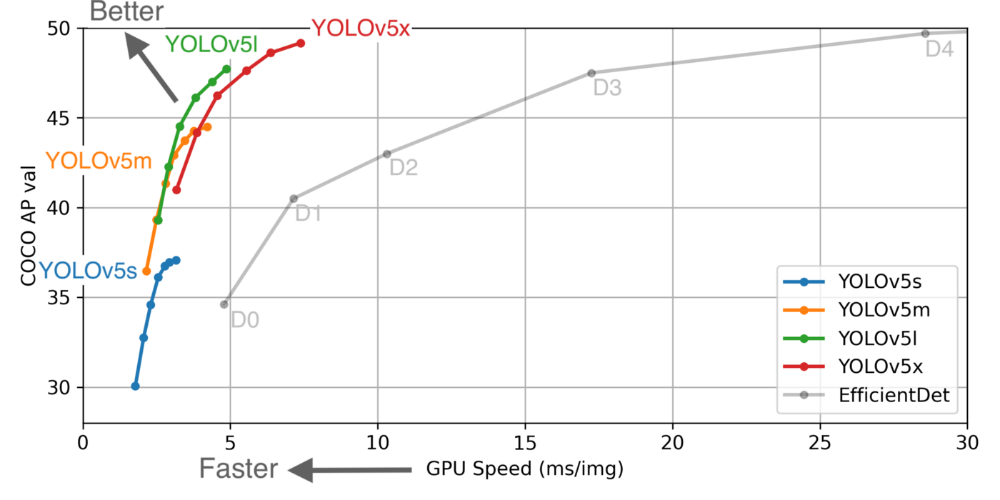
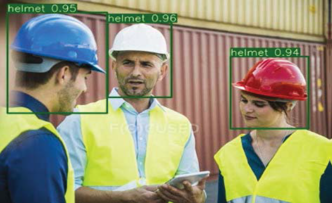

  <h1 align="center">SAFETY HAT DETECTION USING YOLOv5</h1>

  
Table of Contents

  <ol>
    <li>
      <a href="#about-the-project">About The Project</a>
      <ul>
        <li><a href="#built-with">Built With</a></li>
      </ul>
    </li>
    <li><a href="#pre-processing-data">Pre-Processing Data</a></li>
    <li><a href="#training-with-yolov5">Training with YOLOv5</a></li>
    <li><a href="#tests">Tests</a></li>
    <li><a href="to-do">To Do</a></li>
    <li><a href="#resources">Resources</a></li>
    <li><a href="#license">License</a></li>
  </ol>

## About The Project

The detection of safety helmets has become an essential means of production safety monitoring, especially in construction sites, coal mines, and other workplaces with extensive applications. 

Traditional object detection methods use a sliding window-based region selection strategy , which is not targeted and has high complexity. And the hand-designed feature extractor is not very robust to the diversity of targets. 

Although traditional detection algorithms can achieve good results in specific scenarios, in complex environments, such as weather changes, uneven distribution of workers, and different helmets, its accuracy is difficult to guarantee. Its generalization ability is poor. Besides, traditional manual design features require a lot of prior knowledge. The three part detection process is cumbersome and computationally expensive and cannot meet the real-time monitoring.

### Built With

This section lists any major technologies that I built this project using. Here are a few examples.
* Python
* YOLOv5
* MatplotlibV
* Numpy
* Sklearn

## Pre-Processing Data

I have used a [publicly available dataset](https://www.kaggle.com/andrewmvd/hard-hat-detection) from Kaggle. The dataset contains 5000 images and their corresponding annotation files, indicating whether a person is wearing a helmet or not wearing it. 

  

In order to train the model, a necessary step will be to change the format of the .xml annotation files so that they conform with the darknet format.

Since the dataset had already been annotated, and resized, I uploaded it in Google Colab. Then I proceeded to download the requirements, importing the necessary libraries and then loading and creating the necessary directories. I used Roboflow to make my yaml files and for creating darknet txt instead of doing it from scratch. Then I split the dataset into Train (70%), Valid (20%) and Test (10%) sets.

Then I created YOLOv5 configuration architecture which basically defines the heads and anchors and save as custom_yolov5s.yaml which is the smallest and fastest model among YOLOv5.

And now it's time to train.

## Training with YOLOv5

“YOLO”, refering to “You Only Look Once”, is a family of object detection models introduced by Joseph Redmon with a 2016 publication “You Only Look Once: Unified, Real-Time Object Detection”. Since then, several newer versions have been released, of which, the first three were released by Joseph Redmon. On June 29, Glenn Jocher released the latest version YOLOv5, claiming significant improvements with respect to its predecessor. The most interesting improvement, is its “blazingly fast inference”. As posted [in this article](https://blog.roboflow.com/yolov5-is-here/) by Roboflow, running in a Tesla P100, YOLOv5 achieves inference times of up to 0.007 seconds per image, meaning 140 FPS!

  

With data.yaml and custom_yolo5vs.yaml files ready to go, I can now start the training. To kick off training I ran the train.py script with the following options: img: define input image size, batch: determine batch size, epochs: define the number of training epochs. (Note: often, 3000+ are common here!), data: set the path to our yaml file, cfg: specify our model configuration, weights: specify a custom path to weights, name: result names, cache: cache images for faster training.

I have trained the model with GPU with 50 epochs and a batch size of 20 which took somewhere around 3 hours.

_For more information, please refer to the [Documentation](https://github.com/rkuo2000/yolov5)_

## Tests

Using detect.py we now can detect helmets or head on the images! I have used a confidence threshold of 40%.

  

## To Do

* Applying bounding box color based on helmet color is really difficult in YOLOv5. I had some ideas about how I could achieve this but wasn’t successful due to lack of time. The idea I had was: 1. Extract the top 25% of the bounding box, 2. Define a function which basically finds out the dominant color in roi, 3. Use the color returned by that function which is a tuple (r, g, b) and plot the box.

* Since I was short on time, I couldn’t train on a large number of epochs which decreased the accuracy. It took like 3 hours on just 50 epochs. I did train on 300 epochs before which took like 11 hours but I lost that data cause Colab deletes everything if machine is on idle. Having a larger dataset would help too. Colab only provides me with 12 hours of GPU usage as a free user, so it was pretty difficult managing the time and not having stuff break which happens pretty often on these cloud platforms.

## Resources

* https://github.com/rkuo2000/yolov5
* https://www.kaggle.com/andrewmvd/hard-hat-detection
* [F. Zhou, H. Zhao and Z. Nie, "Safety Helmet Detection Based on YOLOv5," 2021 IEEE International Conference on Power Electronics, Computer Applications (ICPECA), 2021, pp. 6-11, doi: 10.1109/ICPECA51329.2021.9362711](https://ieeexplore.ieee.org/document/9362711)
* https://colab.research.google.com/github/ultralytics/yolov5/blob/master/tutorial.ipynb

## LICENSE

Distributed under the MIT License. See `LICENSE` for more information.

